<!-- ============================================================
  Taroll · GitHub Profile README   ·   主题：粉白 Pink & White
  ------------------------------------------------------------
  ⚠️ 实现说明
  github.com 会过滤 README 中的自定义 CSS 与内联样式，所以「粉白主题」
  是通过可着色的远程 SVG 卡片实现的：
    readme-typing-svg / github-readme-stats / streak-stats
    github-profile-trophy / shields.io / komarev / Platane Snake
  文字颜色沿用 GitHub 默认（自动适配浅色 / 深色）。

  首图 pet-panel.svg 是「猫猫看板」动态 SVG：外观与 index.html 里的看板一致，
  猫 / 电脑的像素网格与配色 1:1 取自 index.html，纯 SVG 动画（不可交互）。

  左侧栏（头像 / 粉丝数 / 成就）与顶部 tab 是 GitHub 原生 UI，
  无法通过 README 自定义 —— 完整双栏版见独立页面 index.html。
  ============================================================ -->

<div align="center">

<!-- ============ 猫猫看板 ============ -->


<br />

<sub>这张图每天自动更新：机器人会查我最近一次 push 是几天前，今天有提交就是 5/5 happy，隔得越久血条越空，超过 7 天变 💔</sub>

<br />

<!-- ============ README 里能点的交互：折叠面板 ============ -->
<!-- GitHub 会剥掉 README 里的 script / 事件 / 内联样式，<details> 是唯一能点的原生交互 -->
<details>
<summary><b>🖱️ 点我展开：猫猫饿了一天长什么样（README 里能点的交互演示）</b></summary>

<div align="center">

<br />



<br /><br />

<sub>超过 24h 不理咪 → 血条归零、猫猫变 sad ｜ 真正能点的 Feed / Water / Play 在 <a href="https://0chu0.github.io/0chu0/">可交互完整版</a> 里</sub>

</div>

</details>

<br />

<!-- ============ 动态打字机（粉色，浅/深色双图） ============ -->
<picture>
  <source media="(prefers-color-scheme: dark)"
    srcset="https://readme-typing-svg.demolab.com/?lines=Hi%2C%20I%27m%20Taroll.;impossible%20empathy;AI%20PM%20%2F%20SA&fontColor=F2789F&background=181216&width=620&height=42&duration=4500&pause=1200&center=true&vCenter=true" />
  
</picture>

<br />

🩷 Interested in <b>AI PM / SA</b>.

<br />

<!-- ============ 信息胶囊（粉色描边） ============ -->


<br />

<!-- ============ 行动按钮 ============ -->
<a href="https://github.com/0chu0"></a>
<a href="mailto:3552955252@qq.com"></a>
<a href="https://github.com/0chu0"></a>

<br /><br />

<!-- ============ 访客计数 ============ -->
<a href="https://komarev.com/ghpvc/?username=0chu0&label=Profile%20Views&color=E0578A&style=flat-square">
  
</a>

</div>

---

## 🩷 About

**Taroll** · her/she · 中国传媒大学 · 北京

> impossible empathy

关注 **AI PM / SA** 方向，正在做 AI Agent 与后端开发，本科毕设进行中。

> 📌 **开放机会**
> 目前在找 2027 届实习 / 秋招机会，也欢迎交流技术与项目。

---

## 💻 Terminal

```bash
$ whoami
Taroll — 可以叫我芋圆

$ current_focus
- ✨ AI Agent
- 📝 后端开发
- 🔭 本科毕设
- 💬 等offer
- 🌱 探索世界

$ stack
LangGraph/LangChain, Langfuse/LangSmith，FastAPI, PostgreSQL, Redis, ChromaDB, FastMCP, SSE
```

---

## 🛠 Stack

 &nbsp; &nbsp; &nbsp; &nbsp; &nbsp; &nbsp; &nbsp; &nbsp; &nbsp;

 &nbsp; &nbsp; &nbsp; &nbsp; &nbsp; &nbsp; &nbsp;

 &nbsp; &nbsp; &nbsp; &nbsp; &nbsp; &nbsp;

 &nbsp; &nbsp; &nbsp; &nbsp; &nbsp; &nbsp; &nbsp; &nbsp; &nbsp; &nbsp;

 &nbsp; &nbsp; &nbsp; &nbsp; &nbsp; &nbsp; &nbsp;

---

## 📊 My GitHub Stats

<div align="center">

<picture>
  <source media="(prefers-color-scheme: dark)"
    srcset="https://github-readme-stats.vercel.app/api?username=0chu0&show_icons=true&hide_border=true&bg_color=181216&title_color=F2789F&text_color=E6D9DE&icon_color=F2789F&card_width=495" />
  
</picture>

<br />

<picture>
  <source media="(prefers-color-scheme: dark)"
    srcset="https://github-readme-stats.vercel.app/api/top-langs/?username=0chu0&layout=compact&hide_border=true&bg_color=181216&title_color=F2789F&text_color=E6D9DE&langs_count=8&card_width=400" />
  
</picture>

<br />

<picture>
  <source media="(prefers-color-scheme: dark)"
    srcset="https://streak-stats.demolab.com/?user=0chu0&hide_border=true&background=181216&stroke=F2789F&ring=F2789F&fire=FF9EC0&currStreakNum=E6D9DE&sideNums=E6D9DE&currStreakLabel=F2789F&sideLabels=A8939C&dates=A8939C&date_format=M%20j%5B%2C%20Y%5D" />
  
</picture>

</div>

---

## 🏆 Trophy

**项目制**

- 国家级｜大学生创新创业训练计划项目 良好结项（2024-2025）
- 校级｜大学生创新创业训练计划项目 良好结项（2025-2026）
- 腾讯｜游戏引擎图形学远程课题实践精英人才培养计划 完成项目（2025）

**比赛制**

- 北京市大学生机械创新设计大赛 市二等奖（2024）
- 拯救者杯 OPENAIGC 开发者大赛 AI 黑马奖（2024）
- “京彩大创”北京大学生创新创业大赛 校三等奖（2024）
- 2024年“挑战杯”首都大学生创业计划竞赛 校三等奖（2024）
- 校级三等奖学金（2025）

**语言**

- 雅思 IELTS 7.0

---

## 🐍 Contribution

<div align="center">

<picture>
  <source media="(prefers-color-scheme: dark)"
    srcset="https://raw.githubusercontent.com/0chu0/0chu0/output/github-contribution-grid-snake-dark.svg" />
  
</picture>

</div>

---

## 📰 NEWS

| 日期 | 动态 |
| :-- | :-- |
| 2026.10.05 | 更新个人主页 |
| 2026.10.02 | Triply 旅行规划助手最近推送 |
| 2026.09.07 | 毕设仓库最近推送 |

---

## 📄 PROJECTS

**Triply-travel-planner** — Triply·AI智能旅行规划助手（多agent+RAG）
`Python` `Multi-Agent` `RAG` · [Repo](https://github.com/0chu0/Triply-travel-planner)

**wifi-densepose-study** — 中国传媒大学本科毕业论文（设计）：Wifi穿墙透视原理分析研究与技术实现
`WiFi Sensing` `DensePose` `Thesis` · [Repo](https://github.com/0chu0/wifi-densepose-study)

**nfs-binaural_study** — 腾讯游戏引擎图形学远程课题实践精英人才培养计划：AI双耳化渲染
`Python` `PyTorch` `Spatial Audio` · [Repo](https://github.com/0chu0/nfs-binaural_study)

**0chu0** — 主页展示
`Profile` `README` · [Repo](https://github.com/0chu0)

---

<div align="center">

**impossible empathy**

🔗 上面是静态展示版 · **真正能动、能上手点的交互版本在这里** → [0chu0.github.io/0chu0](https://0chu0.github.io/0chu0/)

<sub>© 2026 Taroll · 猫猫程序员 · 粉白 Pink &amp; White theme</sub>

</div>
